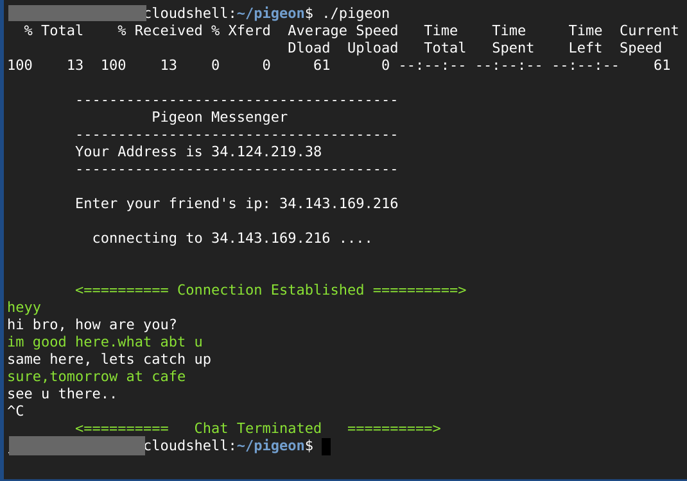

# Pigeon Messenger

This is a decentralised terminal application (prototype) for peer to peer communication. It is using the UDP hole punching methord to establish a peer to peer connection. There is no rendezvous server, distributed hash tables or any other special protocols that will help the peer discover each other, it has to be done by manually typing in the peers IP address. The puprose of this project is to explore UDP hole punching, however it is not reliable in all scenarios since some type of NATs will block it.



## Installing
Since the udp hole punching is implemented from scratch, there is no need to install any special library. All the libraries used in this project (sockets,threading,sys..) are part of the standard python package.

Apart from python, you will need to have the cURL command line tool installed.
```
sudo apt update && sudo apt upgrade
sudo apt install curl
```
After that you can clone this repo and use it.
```
git clone https://github.com/jishnujp/pigeon.git
```
cd into the repo and run it.
```
cd pigeon
./pigeon
```

## Conclusion

This is by no means a plug and play p2p chat app, however the techique udp hole punching is well implemented here, it can be used for experimenting different approaches to p2p networking. Some NATs will block this but if you tweak it enough I think most of them can be bypassed to establish a p2p connection. With some kind of discovery mechanism or protocol (try rendezvous server, distributed hash tables etc..), this can be developed into a small network. 